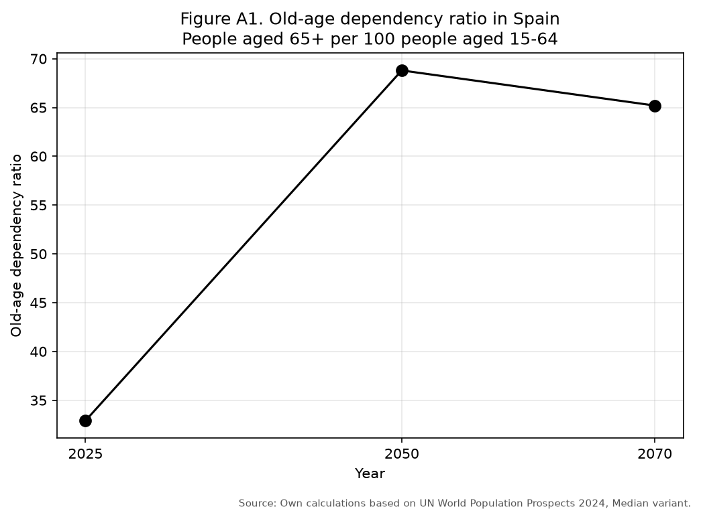

# Spain's Pension Reform and Ageing

*Sustainability, adequacy and intergenerational trust.* A country study of the
pressure that population ageing puts on Spain's pay-as-you-go (PAYG) public
pension system, using UN demographic projections and official expenditure
forecasts for the benchmark years **2025, 2050 and 2070**.

## The question

Spain's public pensions are mainly **PAYG**: today's workers finance today's
retirees. As the population ages — lower fertility, higher life expectancy, the
baby-boom retiring — the number of pensioners rises relative to workers. The
report asks: **can Spain keep pensions adequate while remaining financially
sustainable and fair to younger generations?**

## Data and method

- **Demography** — UN World Population Prospects 2024 (Spain, both sexes, median
  variant), aggregated into 0-14 / 15-64 / 65+ / 80+. The key indicator is the
  **old-age dependency ratio** `D = (P65+ / P15-64) × 100`.
- **PAYG simulation** — required contribution rate `τ = b × d`, where `b` is the
  benefit ratio (pension as a share of the average wage) and `d` the dependency
  ratio. Three adequacy scenarios: `b = 40% / 50% / 60%`. This isolates the PAYG
  mechanism; it is *not* an actuarial forecast.
- **Sustainability & adequacy** — public pension expenditure as a share of GDP
  (AIReF, OECD, FEDEA, EU Ageing Report) and the OECD gross replacement rate.

## Key results

**Ageing (UN WPP 2024).** The old-age dependency ratio roughly doubles by 2050,
while the working-age population shrinks by ~8 million:

| Year | Working-age (15-64) | 65+        | Old-age dependency | Share 80+ |
|------|---------------------|------------|--------------------|-----------|
| 2025 | 31,482,278          | 10,364,384 | 32.9               | 6.5%      |
| 2050 | 23,562,465          | 16,201,102 | 68.8               | 13.9%     |
| 2070 | 20,991,350          | 13,696,354 | 65.2               | 17.6%     |



**PAYG pressure.** Keeping the same pension generosity, the required contribution
rate almost doubles by 2050 — e.g. under medium adequacy (`b = 50%`) it rises
from **16.4%** (2025) to **34.4%** (2050) before easing to **32.6%** (2070).

**Sustainability & adequacy.** Public pension spending is projected to climb from
~13% of GDP today to **16–17%** by 2050–2070 across sources. Meanwhile Spain's
gross replacement rate (~**80%**) is well above the OECD average (~52%): the
Spanish pension promise is socially generous but costly to sustain as Spain ages.

**Conclusion.** Spain faces a joint problem of sustainability, adequacy and
intergenerational credibility. The report argues for a gradual reform package —
stronger employment, realistic retirement incentives, protection for arduous
jobs, greater transparency (a "pension trust account") and a regulated
complementary savings layer — so the adjustment is shared fairly rather than
loaded onto younger workers.

## Repository structure

```
spain-pension-system/
├── data/
│   ├── unpopulation_dataportal_*.xlsx   # UN WPP 2024 export (git-ignored)
│   └── README.md                        # data dictionary
├── src/                     # Python analysis pipeline
│   ├── config.py            # paths, benchmark years, hand-entered source data
│   ├── data_prep.py         # load UN WPP, compute ageing indicators
│   ├── analysis.py          # demographic table + PAYG scenarios (Tables A1, A2)
│   ├── plots.py             # appendix figures A1-A6
│   └── main.py              # end-to-end pipeline (entry point)
├── results/                 # generated outputs (git-ignored): tables/ + figures/
├── assets/                  # figure embedded in this README
├── docs/                    # the research report (git-ignored)
├── legacy_R/
│   └── public_economics_pension_clean.R   # original R script (reference)
├── environment.yml          # conda environment
└── requirements.txt         # pip dependencies
```

## Reproduce

Place the UN WPP Excel file in `data/`, then, using **conda**:

```bash
conda env create -f environment.yml
conda activate spain-pension-system
python -m src.main
```

Or with **pip**: `pip install -r requirements.txt` then `python -m src.main`.
This writes the appendix tables (CSV + one Excel workbook) to `results/tables/`
and figures A1-A6 to `results/figures/`.

## Python ↔ R replication

The analysis was first written in **R** (`tidyverse`) and rewritten in **Python**
(`pandas`, `matplotlib`). Being simple arithmetic on the UN data plus fixed
source values, the Python pipeline reproduces the report's Appendix Tables A1-A2
and Figures A1-A6 exactly. The R script is kept in [`legacy_R/`](legacy_R/) as
the reference implementation.

## Data

UN World Population Prospects 2024 (Spain, median variant), plus pension figures
entered by hand from AIReF, OECD, FEDEA and the EU Ageing Report. The data file
is **not committed** (`data/` is git-ignored); see
[`data/README.md`](data/README.md) for the schema.
